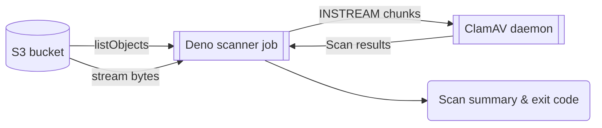

<div align="center">
 
# <br>S3 Antivirus Scan

[](https://operations-engineering-reports.cloud-platform.service.justice.gov.uk/repository-standards/s3-antivirus-scan)
[](https://github.com/ministryofjustice/s3-antivirus-scan/blob/main/LICENSE)

</div>

<br>
<br>

## Overview

S3 Antivirus Scan is a lightweight Deno service that enumerates objects in an
S3-compatible bucket and streams each file to a ClamAV daemon using the
`INSTREAM` protocol. It suits one-off or scheduled Kubernetes Jobs where the
container only needs network access to S3 and ClamAV.

- Written in Deno with a single external runtime dependency on `@bradenmacdonald/s3-lite-client` (no transitive package dependencies)
- Uses IAM web identity credentials in production and static keys for tests
- Streams objects without temp files, keeping memory predictable
- Surfaces scan outcomes and failure policy via environment configuration



## Prerequisites

- Reachable ClamAV TCP service (see `examples/clamav.yml` for HA setup)
- IAM role with access to the target bucket or testing credentials during local runs (see `examples/irsa-s3-av.tf`)
- S3 bucket with objects sized within the configured `CLAMAV_MAX_FILE_SIZE`

## Limitations

This service is a simple scanner and does not provide:

- Quarantine or deletion of infected files
- Reporting beyond exit codes and console logs
- Parallel scanning (files are scanned sequentially)
- Deduplication, all files listed in S3 are scanned, even if they are identical
- State, all files are scanned on each run

## Local development

Requires

- Docker
- Docker Compose
- Deno installed locally (optional for running scripts without Docker)

---

Running `docker compose up` will start:

- ClamAV
- Minio S3 server
- Deno test runner in watch mode

```sh
docker compose up
```

---

Alternatively, you can re-open the project in a devcontainer using the included
`.devcontainer/devcontainer.json` file. This will set up a development environment
with Deno and Docker installed.

From there, you can run the tests with:

```sh
deno run test --watch
```

## Configuration

The following table lists the environment variables that can be set in the `test.env` file.

When the application is deployed to a Kubernetes cluster (e.g. Cloud Platform), these environment variables
can be set on the deployment manifest or in a ConfigMap.

On Cloud Platform, a Kubernetes secret should be unnecessary, since `AWS_ACCESS_KEY_ID` or `AWS_SECRET_ACCESS_KEY`
should not be set. Instead, create a service account with read only access to the S3 bucket and attach it to the deployment.
The attached service account will populate the `AWS_ROLE_ARN` and `AWS_WEB_IDENTITY_TOKEN_FILE` environment variables.

| Variable                                | Description                                                            | Default          | Required    |
| --------------------------------------- | ---------------------------------------------------------------------- | ---------------- | ----------- |
| **AWS EKS - service account variables** |
| AWS_ROLE_ARN                            | The ARN of the AWS role to assume for accessing the S3 bucket.         |                  | For testing |
| AWS_WEB_IDENTITY_TOKEN_FILE             | The file path to the web identity token for the service account.       |                  | For testing |
| **S3**                                  |
| S3_BUCKET                               | The AWS region where the S3 bucket is located.                         | Empty            | Yes         |
| S3_ENDPOINT                             | The S3 endpoint URL.                                                   | Empty            | Yes         |
| S3_REGION                               | The AWS region where the S3 bucket is located.                         | Empty            | Yes         |
| S3_PREFIX                               | The prefix (folder path) within the S3 bucket to scan                  |
| **S3 (local and testing only)**         |
| AWS_ACCESS_KEY_ID                       | The AWS access key ID for accessing the S3 bucket.                     | Empty            | For testing |
| AWS_SECRET_ACCESS_KEY                   | The AWS secret access key for accessing the S3 bucket.                 | Empty            | For testing |
| **ClamAV**                              |
| CLAMAV_HOST                             | The hostname or IP address of the ClamAV server.                       | clamav           | No          |
| CLAMAV_MAX_FILE_SIZE                    | The maximum file size that ClamAV will scan (in bytes).                | 26214400 (25 MB) | No          |
| CLAMAV_PORT                             | The port number on which the ClamAV server is listening.               | 3310             | No          |
| **Application**                         |
| FAIL_ON_SKIPPED                         | Exit with a non-zero code if a file is skipped (i.e. large file size). | true             | No          |
| FAIL_ON_SCAN_ERROR                      | Exit with a non-zero code if there is a scan error.                    | true             | No          |
| FAIL_ON_INFECTED                        | Exit with a non-zero code if a file is infected.                       | true             | No          |

## Contributing

To build and publish a new version of the Docker image to GitHub Container Registry:

- Create a branch off main.
- Create a PR.
- Merge the PR to main.

The GitHub Actions workflow will build and push the image tagged with `latest` and the git
SHA.

The release can then be tagged in GitHub to create a versioned release of the image.

## Example deployment

Example Kubernetes manifest are provided in the examples folder:

- `examples/job.yml` for a one-off job.
- `examples/cronjob.yml` for a scheduled job.
